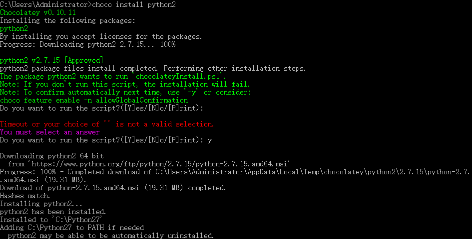
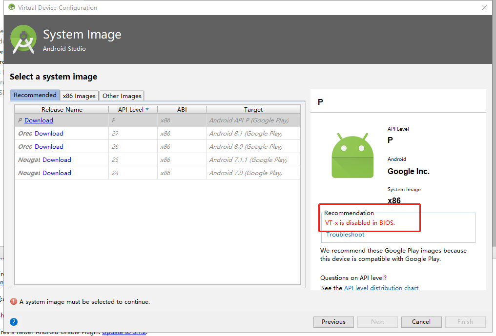
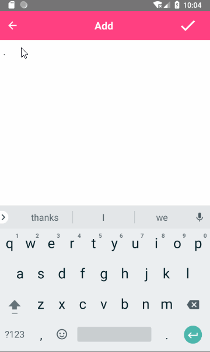
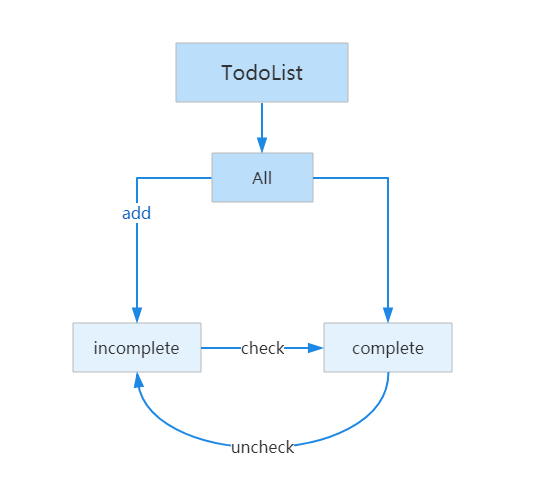

# 前置工作
## （〇）了解官方文档是必须的  
[react-native官方文档](http://facebook.github.io/react-native/docs/getting-started.html)  
[react-native中文文档](https://reactnative.cn/docs/0.51/getting-started.html#python-2)  
## （一）安装必需的软件
以下步骤官网早有详细步骤，在此不必赘述。
1. Chocolatey  
[Chocolatey](https://chocolatey.org/install)的官网
使用管理员打开cmd,输入
```
@"%SystemRoot%\System32\WindowsPowerShell\v1.0\powershell.exe" -NoProfile -InputFormat None -ExecutionPolicy Bypass -Command "iex ((New-Object System.Net.WebClient).DownloadString('https://chocolatey.org/install.ps1'))" && SET "PATH=%PATH%;%ALLUSERSPROFILE%\chocolatey\bin"
```
2. 安装Python 2
 
在cmd中输入

```
choco install python2
```


输入y,不要直接回车。

3. 安装node

```
choco install  nodejs.install 
```
在此之前我已经用nvm安装过node了。

4. 安装jdk8

```
choco install jdk8

```
在此之前我已经去官网下载jdk了。
注意：jdk版本需为8。

5. 安装Yarn、React Native的命令行工具

```
npm install -g yarn react-native-cli
```

设置镜像源
```
yarn config set registry https://registry.npm.taobao.org --global
yarn config set disturl https://npm.taobao.org/dist --global
```

6. 安装Android Studio  
按照官网的配置进行配置即可。（*虽然我觉得很麻烦＞﹏＜*）

7. 初始化项目

```
react-native init AwesomeProject
cd AwesomeProject
react-native run-android
```
然后bug就来了，出现红色的提示  
<!--  -->

我的理解就是模拟器没有关联并启动所导致的。（可能是错误的）


## （二）在模拟器中运行 

然后打算使用Android Studio直接运行项目。
在初步安装完成后按照官网进行配置以完成全部的安装。
打开已存在的项目，注意选择的是项目下的Android文件夹
稍等几分钟运行按钮由灰色变成绿色，但是模拟器并没有跑起来。



原因是 “Vt-x is disabled in BIOS”

遇到问题，首先是想到伟大的网友们。

[华硕主板BIOS UEFI BIOS开启VT步骤](http://www.bluestacks.cn/faq/41_0_1_7.html)  
期间还尝试使用其他模拟器来跑项目，例如"夜神模拟器"，但是怕领导以为我在打游戏，就决定还是用Android Studio，看起来专业一点。

# 实践
## （三）TodoList的结构
0. 完成效果预览  
*晃眼的骚粉 哇咔咔*  
  

1. 为了达到真正的入坑，而不是在坑前停留，我会故意把TodoList写得复杂一丢丢，比如添加导航功能，实现数据存储、组件通信的功能等。  

TodoList 流程图：  
  
*(图片使用processOn制作，好丑)* 

2. 安装所需的插件。
```
npm install react-native-vector-icons react-navigation --save
```
安卓没有navigation，官方推荐 react-navigation，[react-native-vector-icons](https://oblador.github.io/react-native-vector-icons/) 是一个超级好用的图标库，只要复制了图标的名字就可以为所欲为。


3. 根据自己的习惯创建文件夹，我是如下创建的：
```
├── android                                    
├── ios         
├── src                                         
│   ├── todolist                             
│   │   ├── utils                              
│   │   │   └── utils.js                                          
│   │   ├── add.js                              
│   │   ├── all.js
│   │   ├── completed.js
│   │   ├── incomplete.js   
│   │   └── todoItem.js
│   ├── index.js 
│   ├── router.js
├── index.js     
```
这些是用到的文件，其他保持生成时默认的就好了。
## （四）实现TodoList的功能
### 编写router和基本文件
导入所需的文件，并编写项目的整体结构，从代码可以看出，底部的导航可以切换所有的事项，未完成的事项，已完成的事项三个页面。样式什么的就自由发挥吧。
```js
//router.js
import React from 'react';
import { 
  createStackNavigator,
  createBottomTabNavigator
} from 'react-navigation';
import Ionicons from 'react-native-vector-icons/Ionicons';

import AllList from './todolist/all'
import AddTodo from './todolist/add'
import Completed from './todolist/completed'
import Incomplete from './todolist/incomplete'

export const TodolistTabs = createBottomTabNavigator({
  All: {screen: AllList },
  Incomplete: {screen: Incomplete},
  Completed: {screen: Completed},
},
{
  navigationOptions:({ navigation }) => ({
    tabBarIcon: ({ focused, tintColor}) => {
      const { routeName } = navigation.state;
      let iconName;
      if (routeName === 'All'){
        iconName = `ios-list-box${focused ? '' : '-outline'}`
      } else if(routeName === 'Completed'){
        iconName = `ios-flag${focused ? '' : '-outline'}`
      }else if(routeName === 'Incomplete'){
        iconName = `ios-create${focused ? '' : '-outline'}`
      }
      return <Ionicons name={iconName} size={25} color={tintColor} />
      
    }
  }),
  tabBarOptions: {
    activeTintColor: '#FF4081',
    inactiveTintColor: '#455A64',
    labelStyle:{
      fontSize: 13,
    },
    style:{
      backgroundColor: '#fff',
    }
  },
})

export const TodolistStack = createStackNavigator({
  TodoTab: {
    screen: TodolistTabs,
    navigationOptions:{
      title:'Todo list'
    }
  },
  Add: {
    screen: AddTodo,
    navigationOptions:{
      title:'Add',
    }
  }
},
{
  navigationOptions: ({
    navigation
  }) => {
    return{
      headerStyle:{
        backgroundColor: '#FF4081',
        borderBottomColor: 'transparent',
        borderWidth: 0,
        elevation: 0,
        shadowOpacity: 0,
      },
      headerTintColor: '#fff',
      headerTitleStyle: {
        flex: 1,
        textAlign: 'center'
      }
    }
  }
})

```
```js
// src/index.js
import React,{Component} from 'react';
import { TodolistStack } from './router';

export default class App extends Component {
  render(){
    return <TodolistStack />
  }
}

```
```js
// AwesomeProject/index,js
import { AppRegistry } from 'react-native';
import App from './src/index'
AppRegistry.registerComponent('AwesomeProject', () => App);
```
### 编写ALL页面
```js
import React, {Component} from 'react';
import {
 StyleSheet,
 View,
 FlatList,
 TouchableOpacity,
 AsyncStorage,
 DeviceEventEmitter
} from 'react-native';
import TodoItem from './todoItem'
import Ionicons from 'react-native-vector-icons/Ionicons';
import Utils from './utils/utils';

export default class AllScreen extends Component {
  constructor(props){  
    super(props);   
    this.state = {  
      todolistData: [],
    }  
  }  

  componentDidMount() {
    this._getTodolistData();
    this.listener = DeviceEventEmitter.addListener('todolist_add',()=>{
      this._getTodolistData();
    })
  }
  componentWillReceiveProps(){
    this._getTodolistData();
  }
  componentWillUnmount(){
    if(this.listener){
      this.listener.remove();
    }
  }
  _getTodolistData(){
    AsyncStorage.getItem('todolistData', (err, result) => {
      if(err){
        return;
      }
      let todoListArr = (result != null) ? JSON.parse(result) :[];
      this.setState({
        todolistData: todoListArr
      })
    })
  }

  _checkTodo(item){
    let todolistData = this.state.todolistData;
    for(let i = 0 , len = todolistData.length; i<len; i++){
      if(item.id === todolistData[i].id){
        todolistData[i].isComplete = !todolistData[i].isComplete 
       
      }
    }
    AsyncStorage.setItem('todolistData', JSON.stringify(todolistData), ()=>{
    });
  }

  _navigationAdd = () => {
    this.props.navigation.navigate('Add');
  };

  render() {
    let todoList = this.state.todolistData
    return (
      <View style={styles.wrapper}>
        <FlatList
          data={todoList}
          keyExtractor = {(item, index) => item.id.toString()}
          renderItem={({item,index}) => <TodoItem dataItem={item} key={item.id} checkTodo={(item)=>this._checkTodo(item)} /> }
        />
        <TouchableOpacity style={styles.addBtn} onPress={this._navigationAdd}>
          <Ionicons name="md-add" size={38} color="#fff" />
        </TouchableOpacity>
      </View>
    )
  }
}

const styles = StyleSheet.create({
  wrapper: {
    flex: 1,
    backgroundColor: "#fff",
    padding: 10,
  },
  addBtn:{
    position: "relative",
    left: 10,
    bottom: 10,
    width: 60,
    height: 60,
    borderRadius: 60,
    backgroundColor: "#FF4081",
    alignItems: 'center',
    alignContent: 'center',
    justifyContent: 'center'
  }
})

```
### TodoItem组件
因为All、Incomplete、 Complete页面都需要事项的页面，所以将他分离出来做一个单独的组件使用。
```js
import React, {Component} from 'react';
import {
  Alert,
  StyleSheet,
  View,
  Text,
  TouchableHighlight,
  TouchableOpacity
} from 'react-native';
import Ionicons from 'react-native-vector-icons/Ionicons';

class TodoItem extends Component{
  constructor(props) {
    super(props);
    this.state = {
      switchValue: this.props.dataItem.isComplete,
    }
  }
  componentWillReceiveProps(nextProps){
    this.setCompleteState(nextProps.dataItem.isComplete)
  }
  setCompleteState(isComplete){
    this.setState({
      switchValue: isComplete
    })
  }
  _onSwitch(){
    this.setCompleteState(!this.state.switchValue)
    this.props.checkTodo(this.props.dataItem)
  }
  render (){
    return (
      <View style={styles.todoitem}>
        <TouchableHighlight  underlayColor="#90CAF9" onPress={
          this._onSwitch.bind(this)
         }>
          <Ionicons name={this.state.switchValue? "md-checkbox":"md-square-outline"} size={34} style={this.state.switchValue? styles.colorOff:styles.colorOn} />
        </TouchableHighlight>
        <TouchableOpacity>
          <Text style={this.state.switchValue? styles.itemtxtOff:styles.itemtxt}>{this.props.dataItem.content}</Text>
        </TouchableOpacity>
      </View>
    )
  }
}
export default TodoItem;

const styles = StyleSheet.create({
  todoitem: {
    flexDirection: "row",
    justifyContent: "space-between",
    alignItems: "center",
    alignContent: "center",
    padding: 10,
  },
  colorOn:{
    color:"#F50057"
  },
  colorOff:{
    color:"#e0e0e0"
  },
  itemtxt:{
    fontSize: 30,
    color: "#000"
  },
  itemtxtOff:{
    fontSize: 30,   
    color: "#666"
  }
})
```
### Incomplete、Complete页面
Incomplete、Complete页面和All页面基本一样，只是在渲染页面前将数据过滤了。
```js
// incomplete.js
import React, {Component} from 'react';
import {
  StyleSheet,
  View,
  FlatList,
  AsyncStorage
} from 'react-native';
import TodoItem from './todoItem'
import Utils from './utils/utils'

export default class IncompleteScreen extends Component {
  constructor(props) {
    super(props);
    this.state = {
      todolistData:[],
      incompleteData: []
    }
  }

  componentDidMount() {
    this._getTodolistData();
  }

  componentWillReceiveProps(){
    this._getTodolistData();
  }
  
  _getTodolistData(){
    AsyncStorage.getItem('todolistData', (err, result) => {
      if(err){
        return;
      }
      let todoListArr = (result != null) ? JSON.parse(result) :[];
      this.setState({
        todolistData: todoListArr
      })
      let todoListFilter= Utils.filterArr(todoListArr);
      this.setState({
        incompleteData: todoListFilter[false]
      })
    })
  }

  _checkTodo(item){
    let todolistData = this.state.todolistData;
    for(let i = 0 , len = todolistData.length; i<len; i++){
      if(item.id === todolistData[i].id){
        todolistData[i].isComplete = !todolistData[i].isComplete 
        AsyncStorage.setItem('todolistData', JSON.stringify(todolistData), ()=>{
        });
      }
    }
  }

  render() {
    let todoList = this.state.incompleteData
    return (
      <View style={styles.wrapper}>
        <FlatList
          data={todoList}
          keyExtractor = {(item, index) => item.id}
          renderItem={({item, index}) => 
            <TodoItem dataItem={item} checkTodo={(item)=>this._checkTodo(item)} />
          }
        />
      </View>
    );
  }
}

const styles = StyleSheet.create({
  wrapper: {
    flex: 1,
    backgroundColor: "#fff",
    padding: 10,
  }
})

```

```js
// utils.js
export default class Utils {
  static filterArr(dataArr) {
    var list = dataArr, data = [];
    for (var i = 0; i < list.length; i++) {
      if (!data[list[i].isComplete]) {
        var arr = [];
        arr.push(list[i]);
        data[list[i].isComplete] = arr;
      } else {
        data[list[i].isComplete].push(list[i])
      }
    }
    return data;
  }
```
Complete页面和Incomplete完全一样，除了将todoListFilter[false]改为todoListFilter[true]。
### Add页面
Add页面中的保存按钮是写在navigationOptions里，如果直接使用this._saveTodo是拿不到这个方法的，需要在navigation中的内置函数setParams中声明，方可使用。
```js
import React, {Component} from 'react';
import {
 StyleSheet,
 View,
 TextInput,
 TouchableOpacity,
 AsyncStorage,
 DeviceEventEmitter
} from 'react-native';
import Ionicons from 'react-native-vector-icons/Ionicons';
import Utils from './utils/utils'

class Add extends Component {
  constructor(props) {
    super(props);
    this.state = { 
      todo: 
        {
          id: "",
          content: "",
          isComplete: false
        },
        todoArr:[]
    };
  }

  static navigationOptions = ({ navigation }) => {
    const params = navigation.state.params || {};
    return {
      headerRight: (
        <TouchableOpacity style={{width: 56, height: 36, paddingRight:20}} onPress={params.saveTodo}>
          <Ionicons name="md-checkmark" size={36} color="#fff" />
        </TouchableOpacity>
      ),
    };
  };

  componentWillMount() {
    this.props.navigation.setParams({ saveTodo: this._saveTodo })
    AsyncStorage.getItem('todolistData', (err, result) => {
      if(err){
        return;
      }
      let todoArr = (result != null) ? JSON.parse(result) :[]
      this.setState({
        todoArr: todoArr
      })
    })
  }
 
  _saveTodo = () => {
    const todoVal = this.state.todo
    this.setState({todoArr: this.state.todoArr.push(todoVal)})
    AsyncStorage.setItem('todolistData', JSON.stringify(this.state.todoArr), ()=>{
      });
    DeviceEventEmitter.emit('todolist_add')
    this.props.navigation.goBack();
  }

  _changeTodo(text){
    let _id = Utils.uniqueId()
    this.setState({
      todo:{
        id:_id,
        content:text,
        isComplete:false
      } 
    })
  }

  render(){
    return (
      <View style={styles.wrapper}>
        <TextInput
          style={styles.textInput}
          underlineColorAndroid="transparent"
          onChangeText={(text)=> {this._changeTodo(text)} }
          value={this.state.todo.content}
          multiline = {true}
          numberOfLines = {4}
          textAlignVertical="top"
          placeholder="add a todo"
          autoFocus={true}
        />
      </View>
    )
  }
}

export default Add;

const styles = StyleSheet.create({
  wrapper: {
    flex: 1,
    backgroundColor: "#fff",
    padding: 10,
  },
  textInput: {
    color: "#333",
    padding: 0,
    fontSize: 18
  }
})
```
在utils.js中添加生成唯一ID的静态函数。
```js
// utils.js
// 这个方法来自网络
static uniqueId(){
    let a=Math.random,b=parseInt;
    return Number(new Date()).toString()+b(10*a())+b(10*a())+b(10*a());
  }

```
到此，添加一个事项，再切换其是否完成的状态都可以实现了。但是我们会发现代码有很多重复的地方，我们尝试将它们都分离出来。
### 页面复用代码的提取
在三个主页面中都出现了这个函数，我们将其分离出来，写到utils.js中
```js
// utils.js
static _checkTodo(item, todolistData){
    for(let i = 0 , len = todolistData.length; i<len; i++){
      if(item.id === todolistData[i].id){
        todolistData[i].isComplete = !todolistData[i].isComplete 
      }
    }
    AsyncStorage.setItem('todolistData', JSON.stringify(todolistData), ()=>{
    });
  }
```
那么在页面中，调用函数的方式如下，将this.state.todolistData作为参数传递过去。
```js
<TodoItem dataItem={item} key={item.id} checkTodo={(item)=>Utils._checkTodo(item,this.state.todolistData)} />
```
### 删除功能的实现
添加了太多事项，不得有删除功能吗？  
这个方法和切换完成状态是类似的。
onLongPress是指长按，长按之后弹出模态框点击ok则执行删除函数。
```js
// todoitem.js
<TouchableOpacity onLongPress={()=>{ this._showModel(this.props.dataItem)}} >
  <Text style={this.state.switchValue? styles.itemtxtOff:styles.itemtxt}>{this.props.dataItem.content}</Text>
</TouchableOpacity>

```
```js
// todoitem.js
_showModel(todo){
  Alert.alert(
    'Delete it ?',
    todo.content,
    [
      {text: 'Cancel', onPress: () => console.log('Cancel Pressed'), style: 'cancel'},
      {text: 'OK', onPress: () => this.props.deleteTodo(todo)},
    ],
    { cancelable: false }
  )
}
```

```js
// utils.js
static _deleteTodo(item, todolistData){
    for(let i = todolistData.length-1; i>=0; i-- ){
      if(item.id === todolistData[i].id){
        todolistData.splice(i, 1)
        AsyncStorage.setItem('todolistData', JSON.stringify(todolistData), ()=>{
        });
      }
    }
  }
```
删除事项之后需要重新获取数据，不然页面上还是会显示已经被残忍删掉的数据。
```js
<TodoItem dataItem={item} key={item.id} checkTodo={(item)=>Utils._checkTodo(item,this.state.todolistData)} 
  deleteTodo={(item) => {Utils._deleteTodo(item, this.state.todolistData); this._getTodolistData()}} />
```
收工！！！
### 说在后面的话
还有修改的功能，心情好再写。  
完整的项目在这里[GitHub Todolist](https://github.com/yiluyanxia/AwesomeProject)。  
*这不是一篇教程，而是一份纪念品。*  
*共勉*